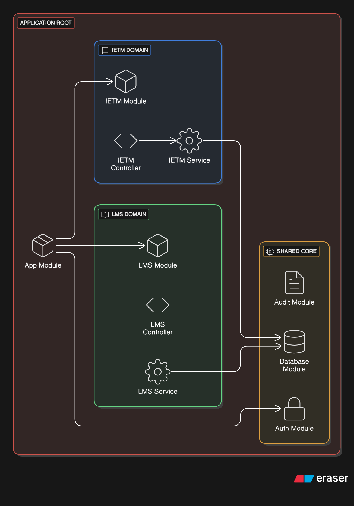

== MODULAR SYSTEM STRUCTURE

=== Architectural Design Pattern
The system utilizes a **Modular Architecture**, leveraging the **NestJS** framework on the server side. This design enforces a strict separation of concerns, where each functional domain is encapsulated within its own discrete module. This ensures:

* **Loose Coupling:** Dependencies between modules are minimized and managed via strict interfaces.
* **Scalability:** Individual modules (e.g., Media Processing) can be optimized or scaled independently based on load.
* **Maintainability:** Updates to specific logic (e.g., changing the Search algorithm) do not impact the core IETM Engine.

=== Core Functional Modules
The application logic is segregated into the following distinct functional units:

[horizontal]
IETM Engine::
  The core kernel responsible for parsing, rendering, and managing S1000D-compliant XML data modules. It handles the link resolution and data module filtering.

LMS Engine::
  Manages the Learning Management System lifecycle, including course assignment, SCORM content delivery, and trainee progress tracking.

CTMR Module::
  (Configuration, Tracking, Monitoring Repository) A dedicated service for asset lifecycle management, maintaining the digital twin of equipment maintenance records and history.

Navigation & Search Service::
  Provides the indexing mechanisms and API endpoints for deep-content search and hierarchical navigation trees across technical manuals.

Assessment & Analytics::
  A data processing module that handles quiz generation, grading logic, and the aggregation of user performance metrics for instructor reporting.

Secure Audit & Counter::
  An isolated security module responsible for non-repudiation. It logs all user actions and manages system counters (e.g., page views, maintenance hours) in a tamper-evident manner.

Media Processing Unit::
  Handles the streaming, transcoding, and optimized delivery of multimedia assets (schematics, 3D models, and training videos) to the frontend.

AI Support Assistant (Chatbot)::
  An intelligent interface layer that processes natural language queries to assist users in locating specific maintenance procedures or troubleshooting guides.

