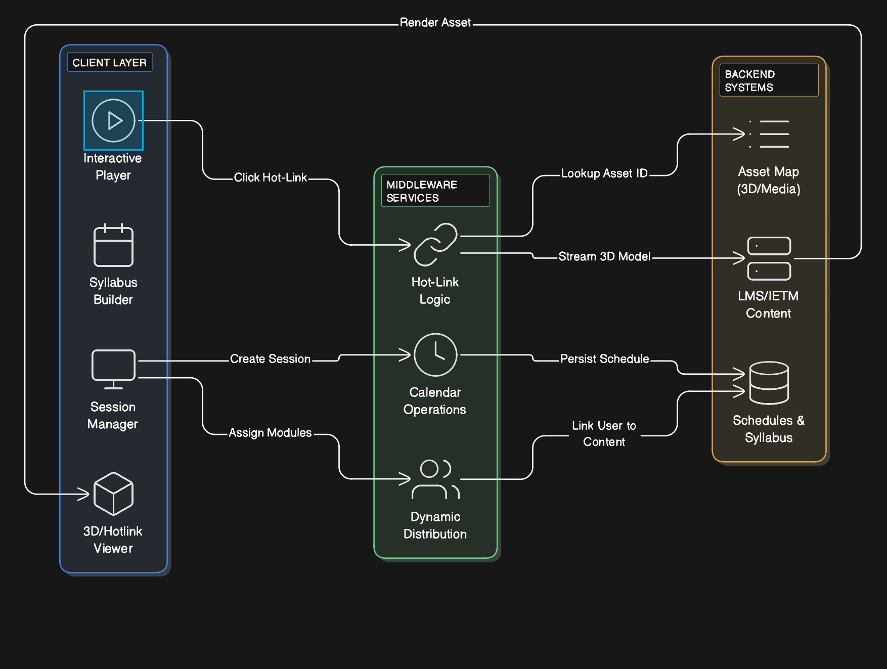
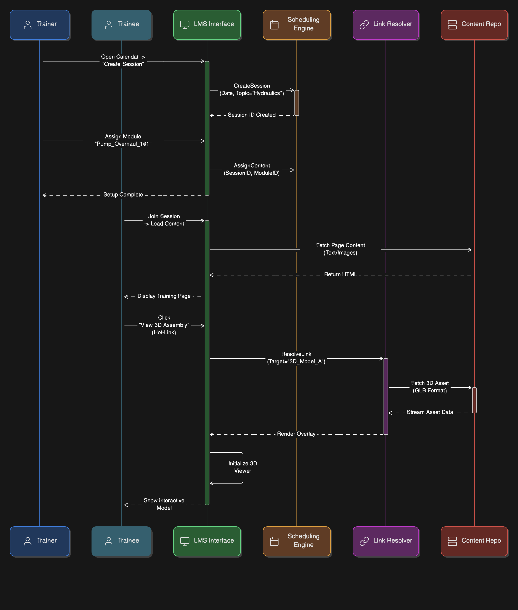

== LMS – Training Delivery & Interaction

[cols="1,3,4", options="header"]
|===
| FR Codes | Context | Details

.5+| *FR-LMS-08* +
*FR-LMS-10* +
*FR-LMS-11*
| *Description*
a|
1. Enable **hot links** to 3D animations and exploded diagrams within training sessions.  
2. Provide **training calendar**, scheduling, and syllabus creation features aligned with hierarchy.  
3. Allow **dynamic assignment** of materials by trainers based on requirement or training program.

| *Architectural Design*
a|
1. **Front End Layer:**  
   * Interactive training interface with embedded 3D animations, diagrams, and visual elements.  
   * Calendar and syllabus builder for scheduling and course planning.  
   * Dynamic assignment panel for live distribution of content to trainees.

2. **Middleware Layer:**  
   * Logic engine linking content to visual assets (3D models, diagrams).  
   * Scheduling engine supporting training hierarchy and calendar operations.  
   * Assignment engine enabling real-time distribution of curated learning content.

3. **Back End Layer:**  
   * Training session database storing metadata (session type, date, assigned training modules).  
   * Link registry for hot-linked multimedia and 3D learning objects.  
   * Repository access manager to retrieve content dynamically.

| *Data Flow*
a|
1. Trainer creates session in the **calendar/syllabus builder** interface.  
2. Trainer selects learning materials and assigns them dynamically to trainees based on program scope.  
3. During live sessions, **hot links** activate embedded 3D animations/exploded diagrams for interactive visualization.  
4. Repository fetches relevant materials with real-time access permissions.  

| *Implementation Methodology*
a|
* **Phase 1 – Interactive Interface Setup:** Develop embedded viewer for 3D animated/diagram assets.  
* **Phase 2 – Scheduling & Syllabus Module:** Implement calendar UI and training hierarchy builder.  
* **Phase 3 – Assignment Engine:** Create dynamic assignment workflows linked to repository.  
* **Phase 4 – Hot Linking Enablement:** Integrate 3D/visual content references into training delivery pages.  
* **Phase 5 – Validation & Testing:** Confirm smooth playback, scheduling accuracy, and real-time assignment controls.

|===
