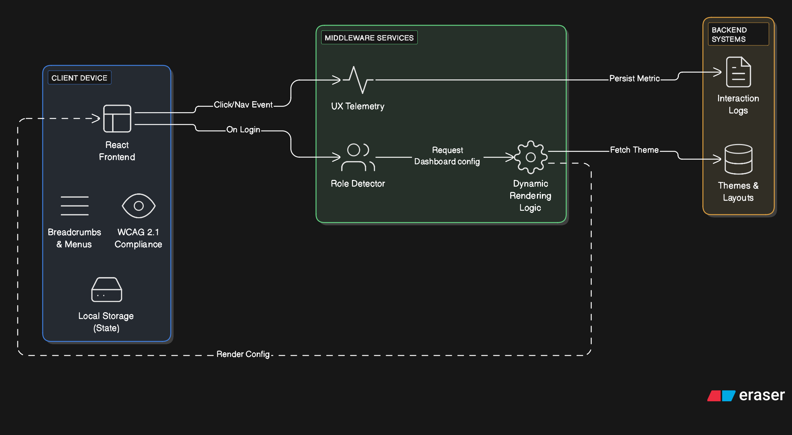
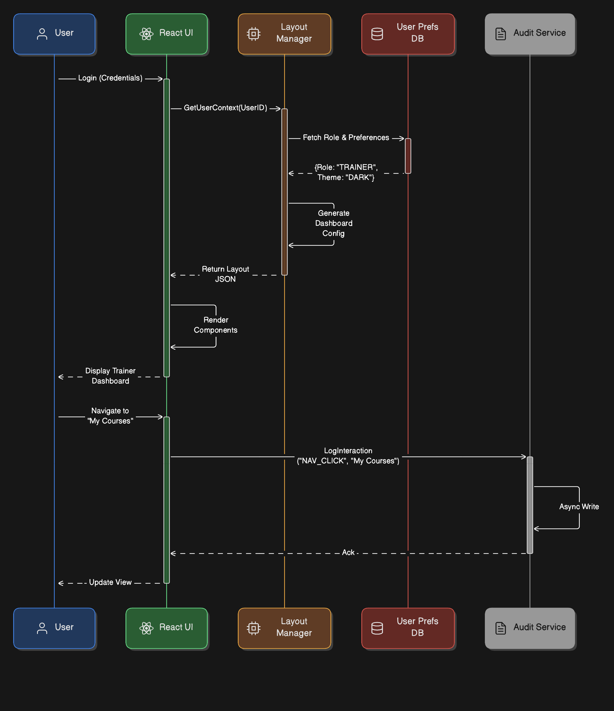

== LMS – User Interface & Experience

[cols="1,3,4", options="header"]
|===
| FR Codes | Context | Details

.5+| *FR-LMS-15*
| *Description*
a|
Provide an ergonomic human interface with intuitive navigation, role-based dashboards, and responsive UI experience.

| *Architectural Design*
a|
1. **Front End Layer:**  
   * React-based responsive UI supporting desktop and tablet use.  
   * Breadcrumb navigation, collapsible menus, and quick-access panels.  
   * WCAG 2.1-compliant navigation and visual accessibility features.

2. **Middleware Layer:**  
   * Session persistence and UI state management.  
   * Dynamic rendering based on user roles and interface preferences.

3. **Back End Layer:**  
   * User profile database storing layout, theme, and accessibility preferences.  
   * Audit logs for UI interaction analytics and usability improvement.

| *Data Flow*
a|
1. **Login & Role Detection:** User logs in → role identified (trainee/trainer/admin).  
2. **UI Rendering:** Middleware retrieves user preferences → interface generated accordingly.  
3. **Interaction Logging:** UI actions recorded in audit logs for usability and performance insights.

| *Implementation Methodology*
a|
* **Phase 1 – UX Framework Setup:** Define ergonomic layout and build reusable navigation components.  
* **Phase 2 – Role-Based Dashboard:** Implement UI rendering logic for trainees, trainers, and administrators.  
* **Phase 3 – Accessibility & Preferences:** Add personalization settings (contrast, font size, layout memory).  
* **Phase 4 – Interaction Logging:** Enable audit capture for continuous UX improvement.  
* **Phase 5 – Testing:** Perform usability and accessibility compliance checks (WCAG 2.1).

|===
