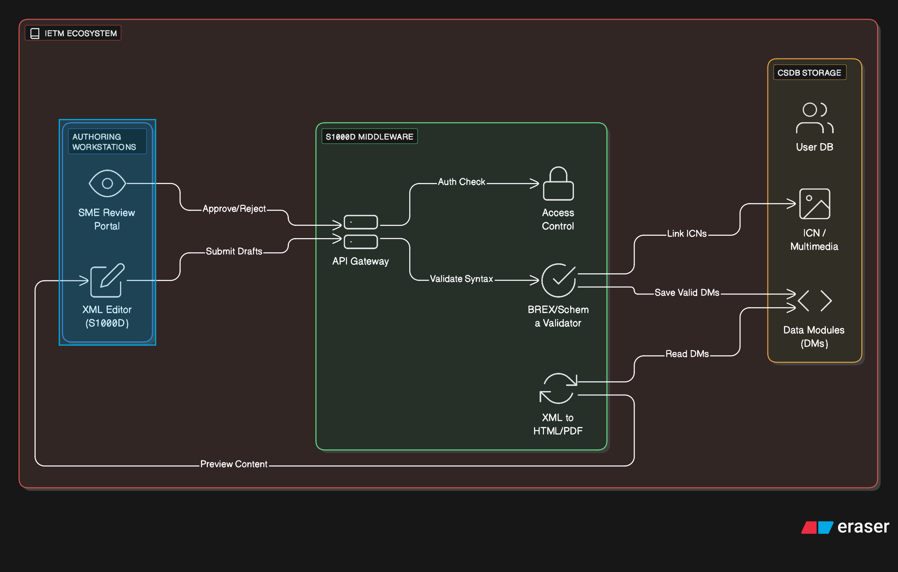
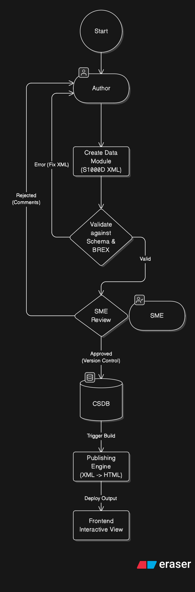

== Authoring & Standards Compliance

[cols="1,3,4", options="header"]
|===
| FR Codes | Context | Details

.4+| *FR-IETM-01* +
*FR-IETM-02* +
*FR-IETM-11* +
*FR-IETM-17*
| *Description*
a|
1. Author IETM content using **S1000D Issue 4.2** standards.
2. Structure content into Data Modules (DMs), ICNs, and Publication Modules.
3. Integrate illustrations and multimedia as per S1000D specifications.
4. Publish IETM Level 4 with interactive features (search, navigation).
5. Deliver content via a web-based layered architecture.

| *Architectural Design*
a|
The module follows a strict 3-tier structure to separate content creation from storage:

1. **Front End:** Web-based XML Editor with real-time schema validation.
2. **Middleware:** NestJS services for BREX validation and Transformation logic.
3. **Back End:** CSDB (Common Source Data Base) storing raw XML and ICNs.

// Insert the Cloud Arch image here

| *Data Flow*
a|
The lifecycle of a Data Module from creation to delivery:

1. **Authoring:** Authors create DMs; system validates against Schema/BREX.
2. **Storage:** Approved DMs are version-controlled in the CSDB.
3. **Publishing:** Middleware transforms XML to web-friendly JSON/HTML.
4. **Delivery:** Frontend renders the interactive content.

// Insert the Flowchart image here

| *Implementation Methodology*
a|
* **Platform:** Client-Server (NestJS + React)
* **Containerization:** Dockerized services managed via Kubernetes.
* **Standard:** S1000D Issue 4.2 / ASD-STE-100.
|===
