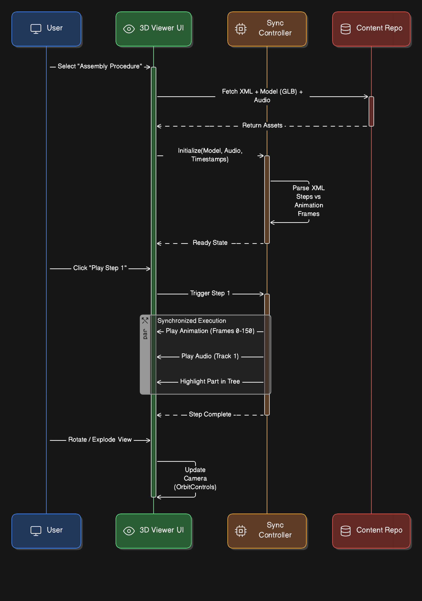

== Content Presentation & Visualization

[cols="1,3,4", options="header"]
|===
| FR Codes | Context | Details

.5+| *FR-IETM-04* +
*FR-IETM-05* +
*FR-IETM-07* +
*FR-IETM-08* +
*FR-IETM-13*
| *Description*
a|
1. Present dynamic, interactive, and interrelated content with contextual linking and filtering.
2. Provide macro hierarchy across systems and manual types using graphical tree view structures.
3. Support 2D zoom capable illustrations and 3D exploded/orthographic views.
4. Deliver 3D animated sequences with synchronized **voice-over** and **text captions**.
5. Offer interactive virtual assembly/disassembly 3D models for training and maintenance operations.

| *Architectural Design*
a|
The visualization architecture integrates multi-format rendering and interactive control features.

1. **Front-End Layer:** HTML-based 2D viewer and WebGL-based 3D viewer (GLB/STEP models).
2. **Visualization Components:** Zoom, rotate, pan, hotspot linking, animation controller, hierarchy panel.
3. **Middleware Layer:** Manages animation timeline syncing and role-based content filtering.
4. **Back-End Layer:** Repository for structured XML (DM/PM), multimedia, metadata indexing, CAD-derived 3D models.
5. **Playback & Synchronization Engine:** Coordinates voice/text alignment and interactive learning models.

image::assets/content_visualization_arch.png[Visualization Architecture, 400, align="center"]

| *Data Flow*
a|
1. User selects system/module from graphical macro hierarchy.
2. UI requests content and related media via API (DM, PM, voice, 2D/3D assets).
3. Backend retrieves XML data + linked illustration/3D model files + metadata.
4. Middleware synchronizes animation timelines and applies role-based visibility.
5. Frontend renders 2D/3D views and interactive controls (hotspots, rotate, zoom, play/pause).
6. User interacts (zoom, rotate, explode, step-through); changes reflected in real-time rendering.

| *Implementation Methodology*
a|
* **Phase 1 – Visualization Framework Setup:** Configure 2D viewer (SVG/Canvas) & 3D viewer (WebGL/Three.js/Babylon.js).
* **Phase 2 – Data & Asset Integration:** Map XML content to viewer components and bind CAD models with metadata.
* **Phase 3 – Interactive Controls:** Implement zoom/pan/rotate, hotspot linking, explosion animation, step simulation.
* **Phase 4 – Multimedia Synchronization:** Build timeline-based synchronization for animations, captions, and voice-over.
* **Phase 5 – Context & Hierarchy:** Create macro hierarchy navigation (tree view + breadcrumbs + filtering).
* **Phase 6 – Testing & Optimization:** Validate performance, accuracy of model rendering, usability feedback, and accessibility compliance.
|===
