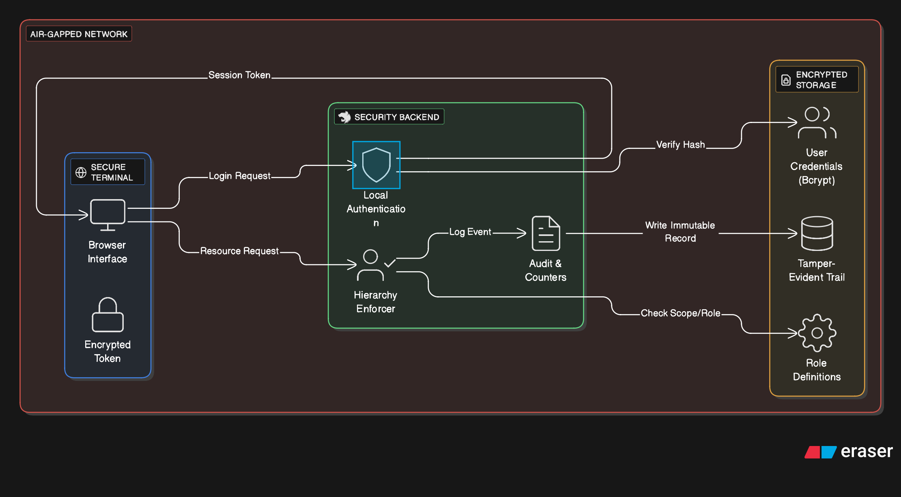
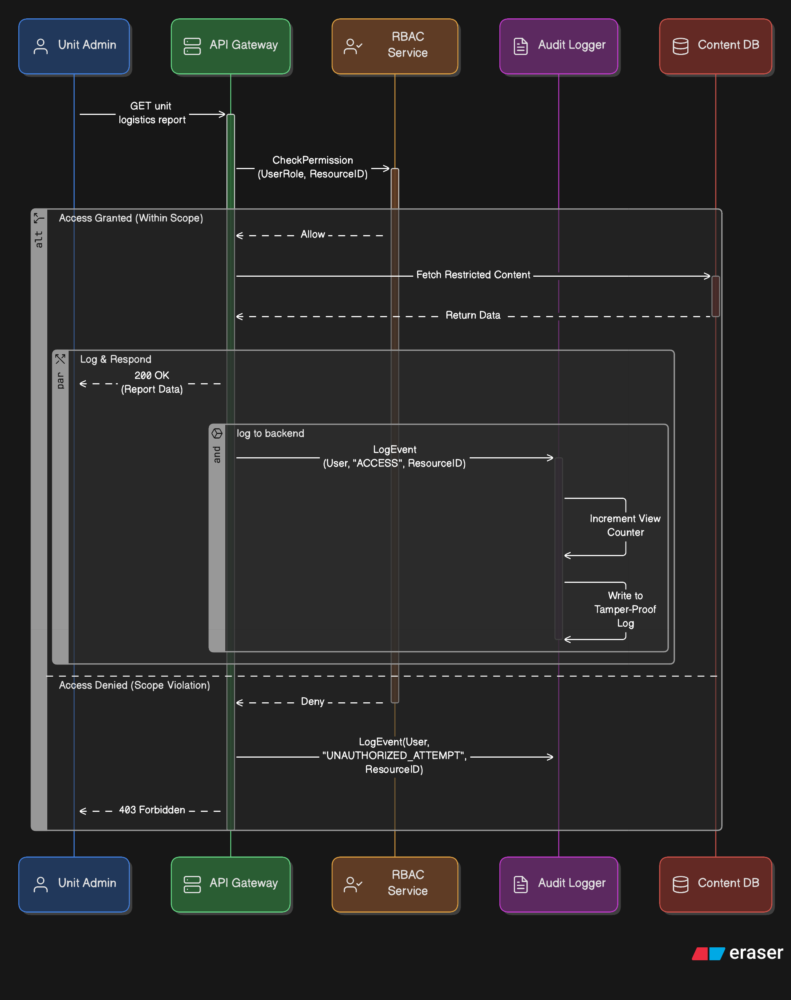

== Access Control & Security

[cols="1,3,4", options="header"]
|===
| FR Codes | Context | Details

.9+| *FR-IETM-06* +
*FR-IETM-18* +
*FR-IETM-19* +
*FR-SEC-01* +
*FR-SEC-02* +
*FR-SEC-03* +
*FR-SEC-04* +
*FR-SEC-05*
| *Description*
a|
1. Control cross-system access via secure login credentials.  
2. Enforce hierarchical, role-based access across systems and subsystems.  
3. System must operate fully offline without internet requirement.  
4. Maintain audit logs for login, content access, print/export events.  
5. Track print counters and access metrics for user accountability.  
6. Support system-level delegation and task-specific access scope.  
7. Provide comprehensive access audit trails for compliance.

| *Architectural Design*
a|
A secure role-based access framework implemented through modular authentication and authorization layers.

1. **Authentication Layer:** Local encrypted credential store, password policy enforcement, multi-role assignment.
2. **Authorization Layer:** RBAC mapping users to content categories, modules, print/export rights.
3. **Offline Operation Layer:** Local server deployment ensuring standalone functioning with no network dependency.
4. **Audit & Monitoring Layer:** Logs capture login, content access, print/export actions; reporting dashboard for admins.
5. **Admin Management Console:** Role assignment, access delegation, audit log review, without internet connection.

| *Data Flow*
a|
1. User enters login credentials on the client application.
2. Local authentication service validates credentials (encrypted store).
3. Authorization engine determines access scope based on assigned role.
4. User actions (view content / print / export) trigger audit logging events.
5. Logs stored locally and available for admin reporting & export.
6. Admin updates roles or permissions directly on local server instance.

| *Implementation Methodology*
a|
* **Phase 1 – Access Model Definition:** Map hierarchical roles to task scope and content classification.
* **Phase 2 – Authentication Module:** Implement credential encryption, offline login, password policies.
* **Phase 3 – Authorization & Enforcement:** Apply role-based visibility, print control, and module restrictions.
* **Phase 4 – Audit & Monitoring:** Implement event tracking, print counters, and reporting interface.
* **Phase 5 – Offline Reliability & Validation:** Test complete usage cycle without internet and perform role-based test cases.

|===
