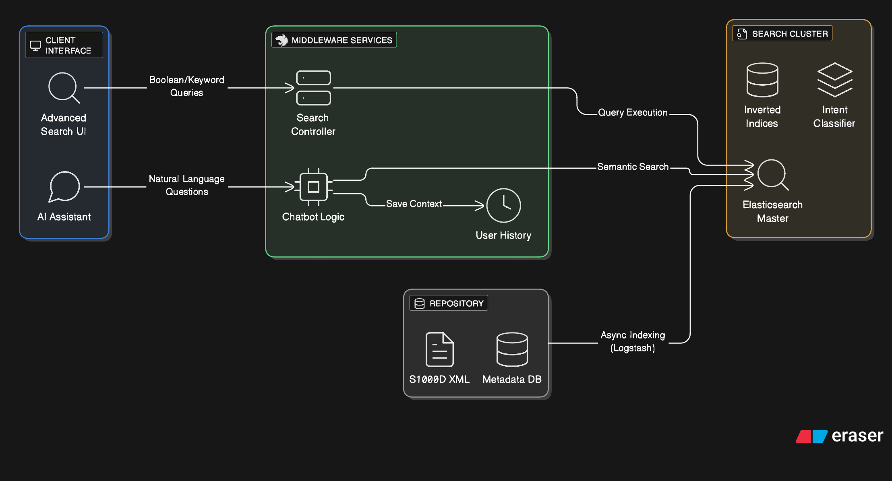
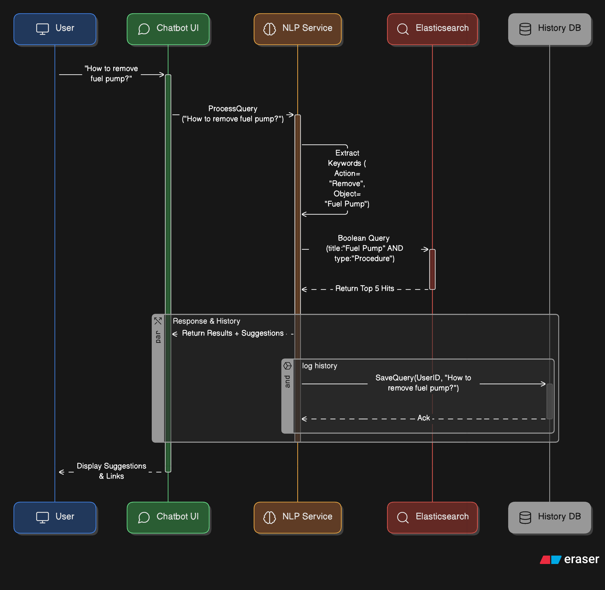

== Search & Interaction

[cols="1,3,4", options="header"]
|===
| FR Codes | Context | Details

.5+| *FR-IETM-16* +
*FR-IETM-21*
| *Description*
a|
1. Provide full-text, Boolean, keyword, and contextual search capabilities.  
2. Enable chatbot with intelligent query-based search and suggestion support.  

| *Architectural Design*
a|
A scalable and high-performance search architecture combining indexing services with interactive AI/Chatbot features.

1. **Search Engine Layer:** ElasticSearch for indexing structured IETM content (DMs, metadata, illustrations).  
2. **Search Interaction Components:** Boolean logic, contextual filters, ranking, and history retention.  
3. **Chatbot Layer:** NLP-powered conversational interface integrated with search APIs for guided results and auto-suggestions.  
4. **Frontend UI:** Unified search interface with filter panel, result preview, and chatbot window with intelligent responses.  
5. **Backend Services:** Query parser, sanitization, ranking engine, and search analytics.

| *Data Flow*
a|
1. User enters search query (via search bar or chatbot).  
2. Request submitted to query parser → ElasticSearch indexing engine.  
3. Engine retrieves relevant DMs, illustrations, metadata, or contextual matches.  
4. Ranking model orders results based on keyword relevance + context filters.  
5. Results displayed → user may refine search or view history/saved queries.  
6. Chatbot may provide guided prompts and auto-suggest alternate queries based on context.  

| *Implementation Methodology*
a|
* **Phase 1 – Search Indexing:** Index DMs, illustrations, metadata into ElasticSearch.  
* **Phase 2 – Search UI:** Implement keyword, Boolean, and contextual search with filtering and ranking.  
* **Phase 3 – Chatbot Development:** Integrate NLP-based chatbot with knowledge base and search APIs.  
* **Phase 4 – Refinement Features:** Add query history, saved searches, and suggestion intelligence.  
* **Phase 5 – Performance & Scalability Testing:** Optimize response time (≤ 10–15 seconds) and handle large content volumes.  

|===
