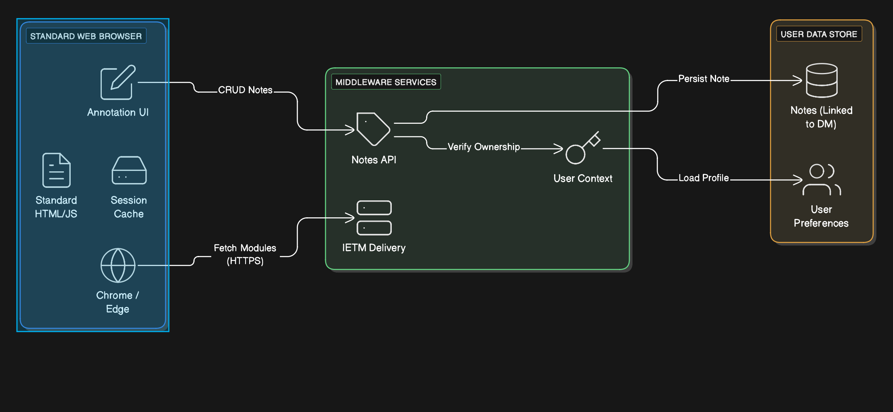
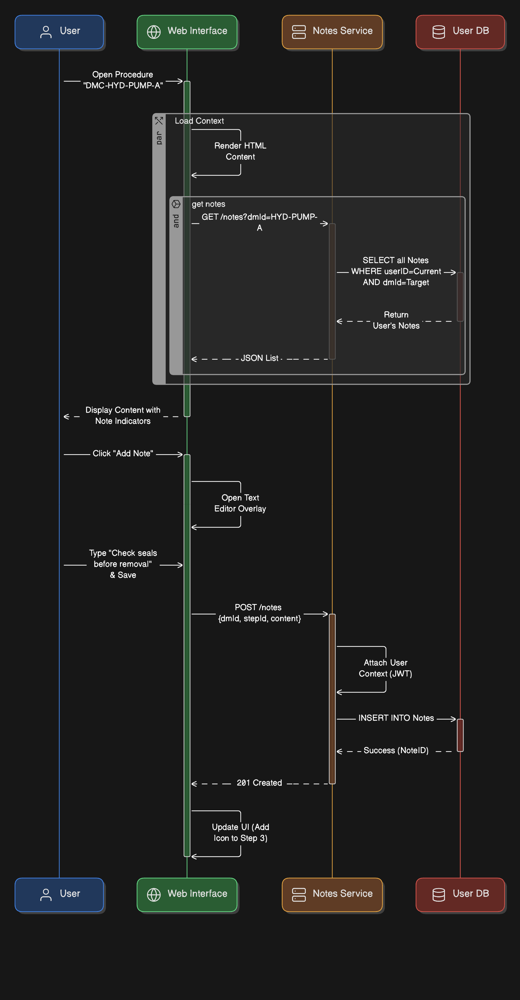

== User Personalization & Runtime Features

[cols="1,3,4", options="header"]
|===
| FR Codes | Context | Details

.5+| *FR-IETM-09* +
*FR-IETM-10*
| *Description*
a|
1. Deliver IETM content via standard web browsers (Chrome/Edge) with no proprietary viewer.  
2. Allow users to create, edit, and securely save notes/remarks against specific content modules.  

| *Architectural Design*
a|
1. **Client Layer (Browser Runtime):** HTML5, CSS3, and JavaScript for rendering without plugins or installation.  
2. **Notes Component:** Annotation panel linked to DMs, illustrations, or text areas.  
3. **Backend Layer:** Secure storage for notes mapped to user ID and content references.  
4. **Authentication Integration:** Notes tied to login and visible only to individual user sessions.  
5. **REST APIs:** Create, update, delete, retrieve notes operations.

| *Data Flow*
a|
1. User logs in and opens a Data Module/illustration.  
2. User adds/updates note via Notes UI panel.  
3. Client sends an API request with user ID + DM reference + note content.  
4. Backend stores note securely and associates it with the authenticated user.  
5. When user revisits content, notes are retrieved and displayed automatically.

| *Implementation Methodology*
a|
1. **Phase 1 – Browser Runtime Enablement:** Implement HTML5-based viewing with responsive layout.  
2. **Phase 2 – Notes Module Development:** Create annotation UI with contextual linking to DMs and media.  
3. **Phase 3 – Backend Persistence:** Implement DB schema per user and secure CRUD API endpoints.  
4. **Phase 4 – Session Integration:** Link notes to role-based login identity.  
5. **Phase 5 – Verification:** Validate access restrictions, offline usage, and performance.

|===
