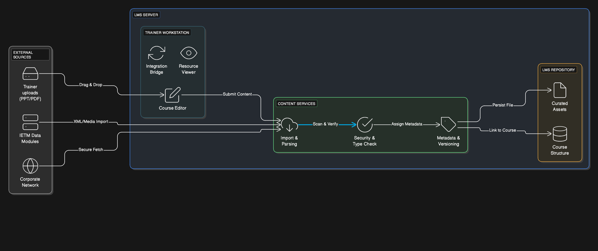
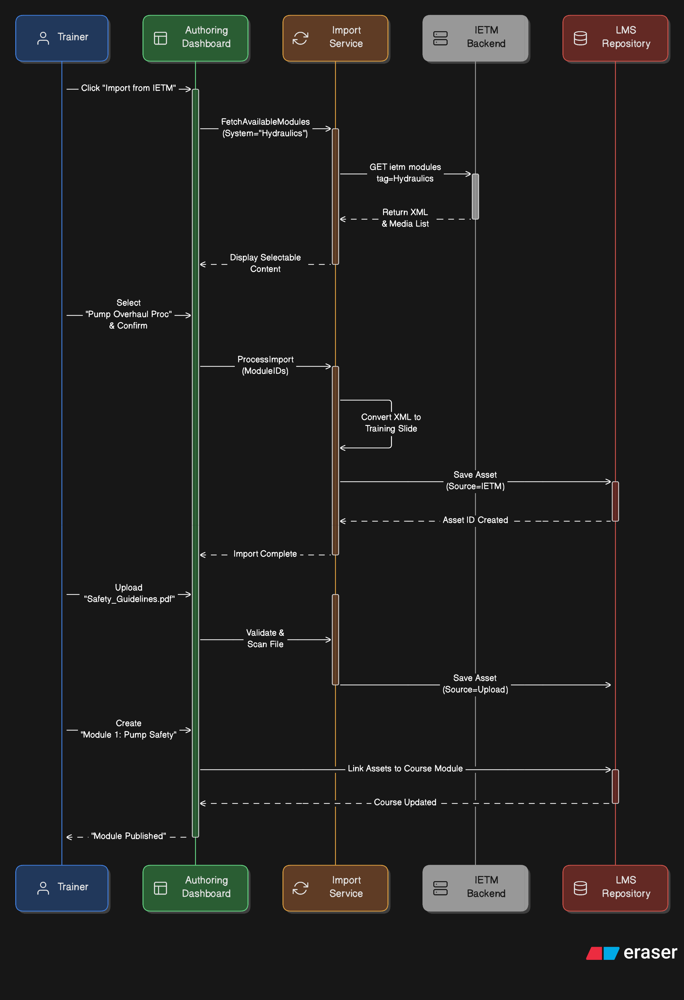

== LMS – Content Creation & Curation

[cols="1,3,4", options="header"]
|===
| FR Codes | Context | Details

.5+| *FR-LMS-02* +
*FR-LMS-03* +
*FR-LMS-04* +
*FR-LMS-06* +
*FR-LMS-09*
| *Description*
a|
1. Support trainer-curated training materials (PDFs, PPTs, videos, etc.).  
2. Support supplier-developed industrial/institutional learning resources.  
3. Enable trainers to import data from IETM for training use.  
4. Provide export/import module to transfer content between LMS and IETM.  
5. Content creation and curation module for training program development.  
6. Allow importing secure content from intranet-based sources.

| *Architectural Design*
a|
1. **Front End Layer:**  
   * Authoring interface for trainers and suppliers.  
   * Drag-and-drop content upload & preview tools.  
   * Import wizard for IETM and secure intranet access.  

2. **Middleware Layer:**  
   * Business logic for content validation, tagging, and transformation.  
   * Integration services for IETM and secured intranet sources.  
   * Role-based access control for content creation and curation.  

3. **Back End Layer:**  
   * Content repository with modular storage & metadata indexing.  
   * Version control for curated and supplier-developed content.  
   * Secured repository access for external materials.

| *Data Flow*
a|
1. Trainers/suppliers upload or author content using the LMS authoring interface.  
2. Trainer imports content from IETM or secure intranet sources via import wizard.  
3. Middleware performs validation and applies system/subsystem metadata tags.  
4. Content stored in repository with versioning and role-based access attributes.  
5. Trainers assign curated content to courses, modules, and training programs.  

| *Implementation Methodology*
a|
* **Phase 1 – Authoring & Upload Tools:** Implement drag-and-drop upload, preview, and rich media editor.  
* **Phase 2 – IETM Integration:** Enable importing/exporting of IETM content modules and mapping metadata.  
* **Phase 3 – Content Repository Setup:** Implement versioning, metadata indexing, and security controls.  
* **Phase 4 – Role-based Authoring:** Restrict creation and publishing rights to trainers and authorized suppliers.  
* **Phase 5 – Validation & Testing:** Validate content handling performance, security, and usability.

|===
